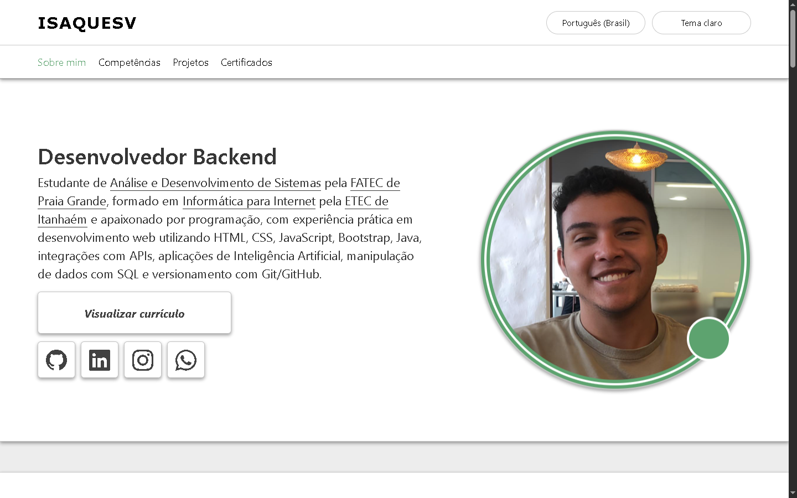
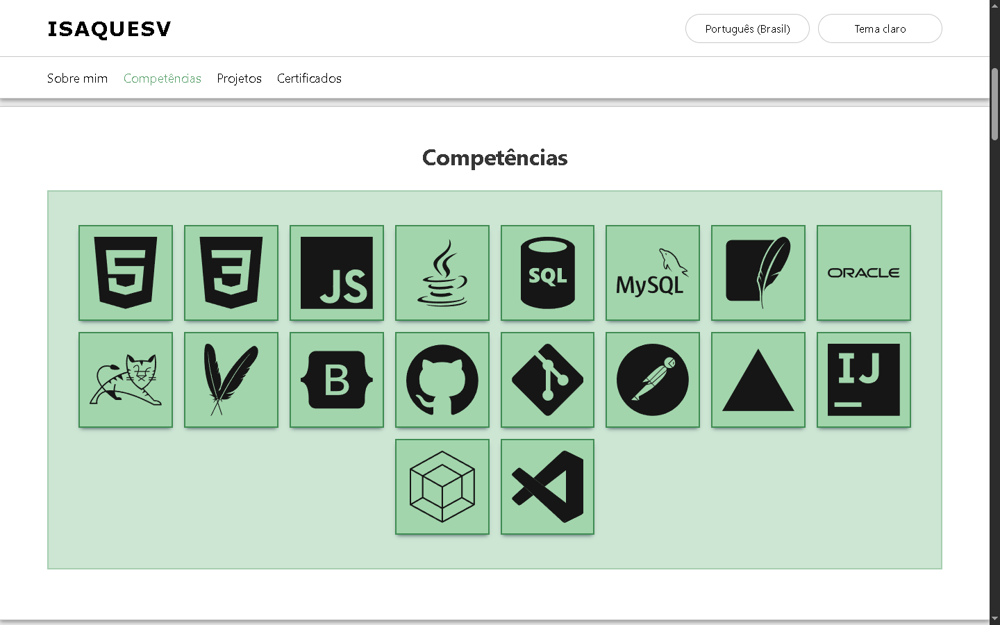
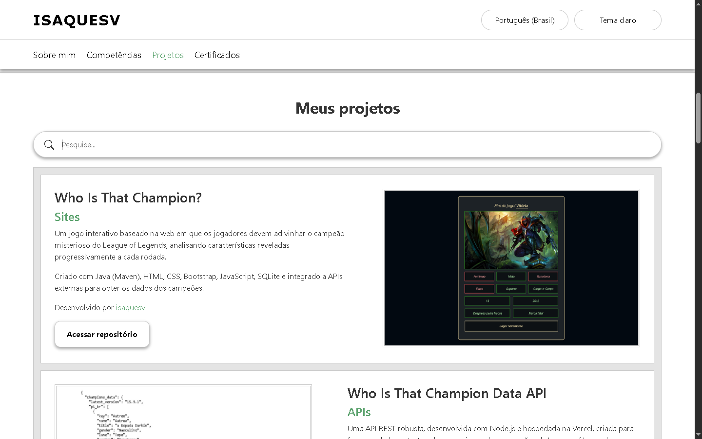
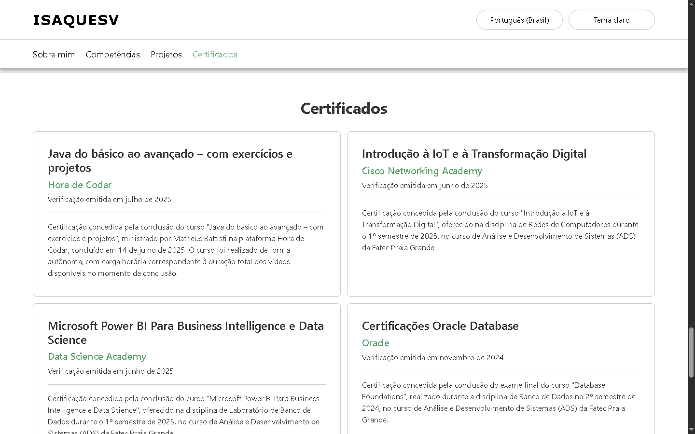
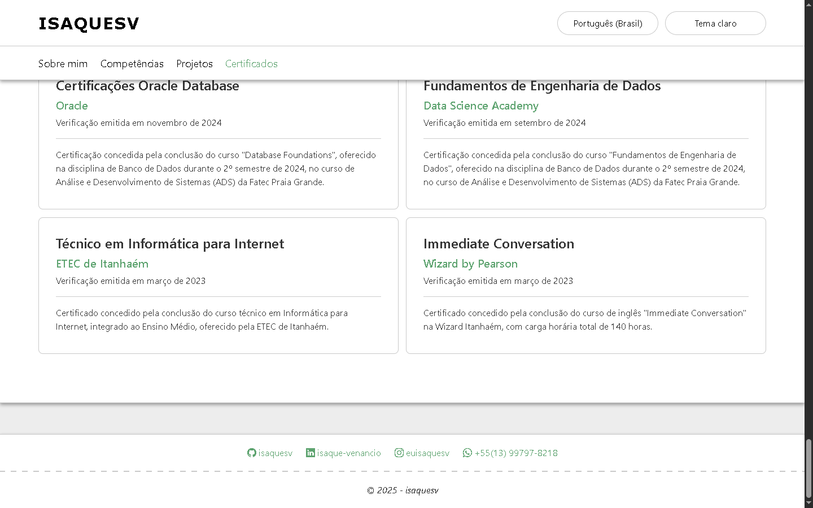
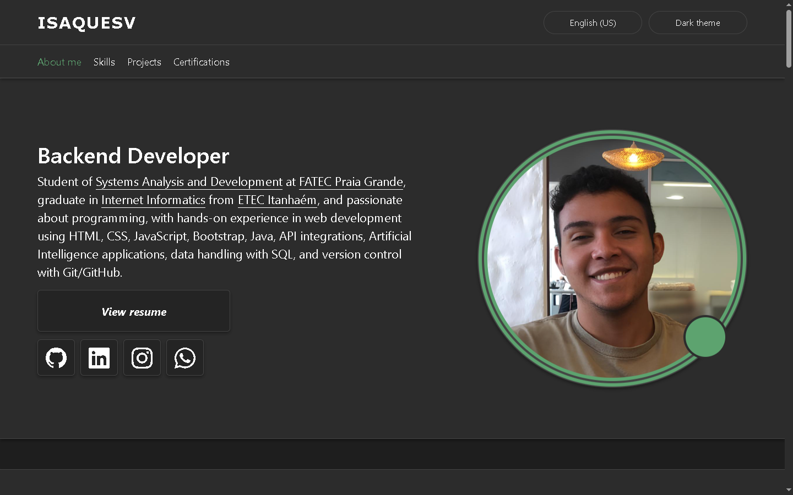
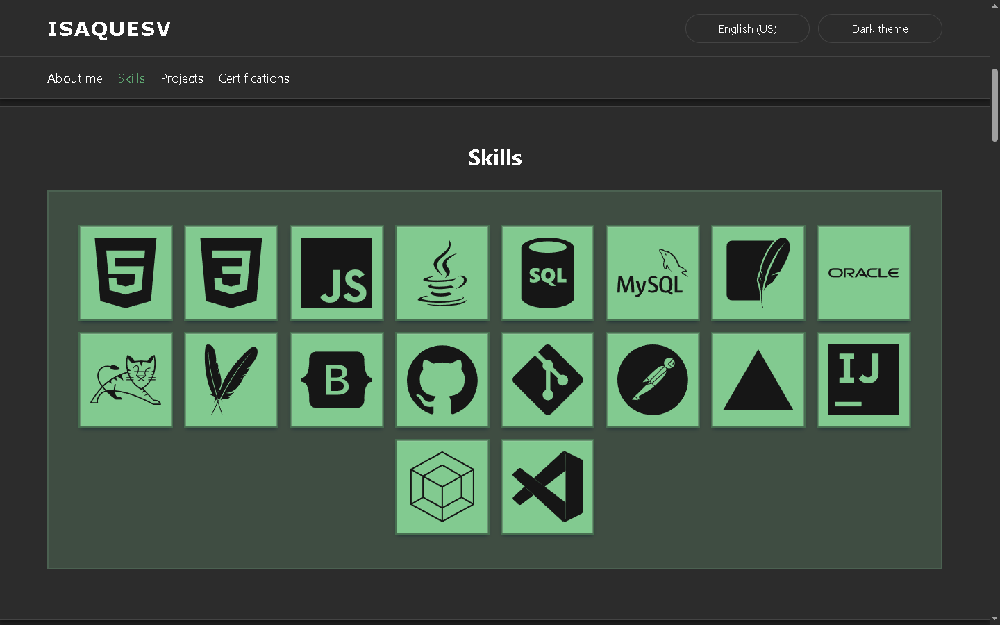
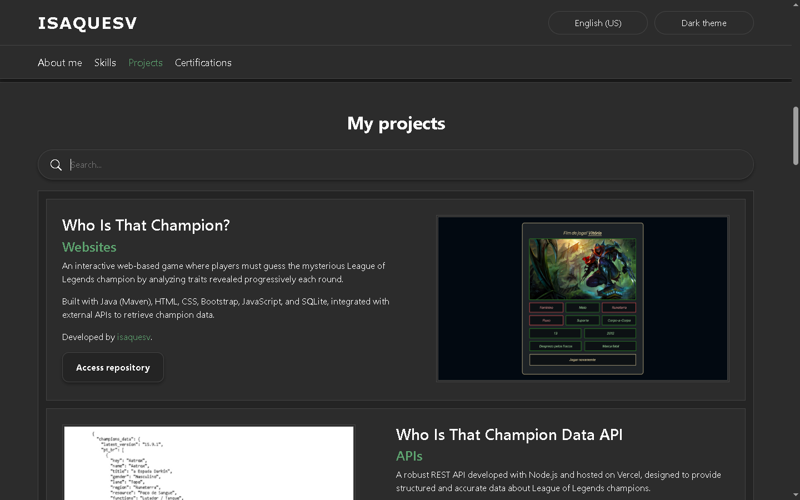
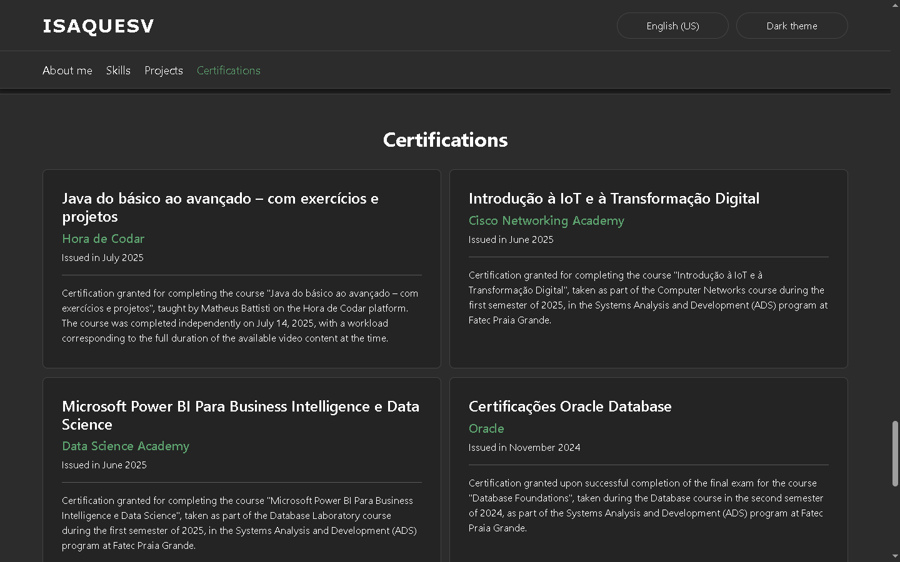
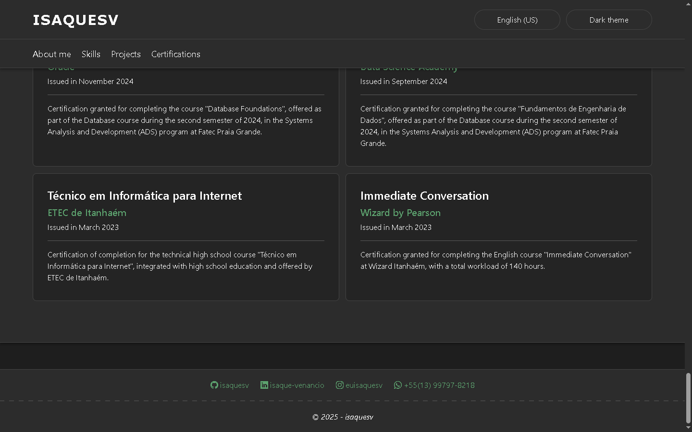

# Portfólio

Portfólio web para documentar meus avanços na programação e aplicar os conhecimentos que venho adquirindo. Desenvolvido com HTML, CSS e JavaScript.

---

## Screenshots











---

## Deploy

Para acessar o deploy desse projeto basta *[clicar aqui](https://isaquesv.github.io/portfolio/)* ou acessar a seguinte URL:

```
  https://isaquesv.github.io/portfolio/
```

---

## Stack utilizada

### **Frontend:** HTML, CSS, Bootstrap e JavaScript.
[](https://skillicons.dev)

### **Backend:** JavaScript.  
[](https://skillicons.dev)

---

## Suporte

Para suporte, caso você encontre algum problema, tenha sugestões de melhorias ou algo do tipo, fique à vontade para adicionar uma **issue** *[clicando aqui](https://github.com/isaquesv/portfolio/issues/new)*!

---

## Autores

- *[isaquesv](https://www.github.com/isaquesv)*

## Licença

- Este projeto está sob a licença *[MIT](https://choosealicense.com/licenses/mit/)*

---

## Outras Screenshots (Tema escuro)









