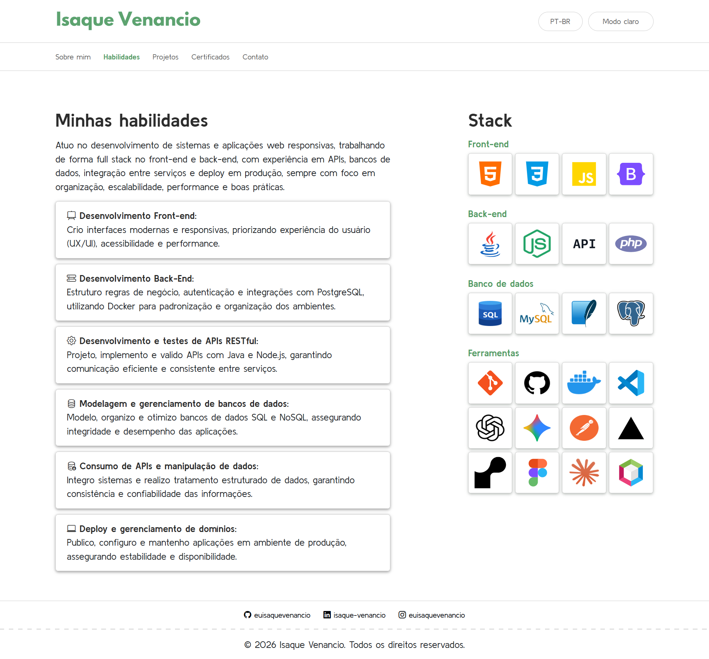
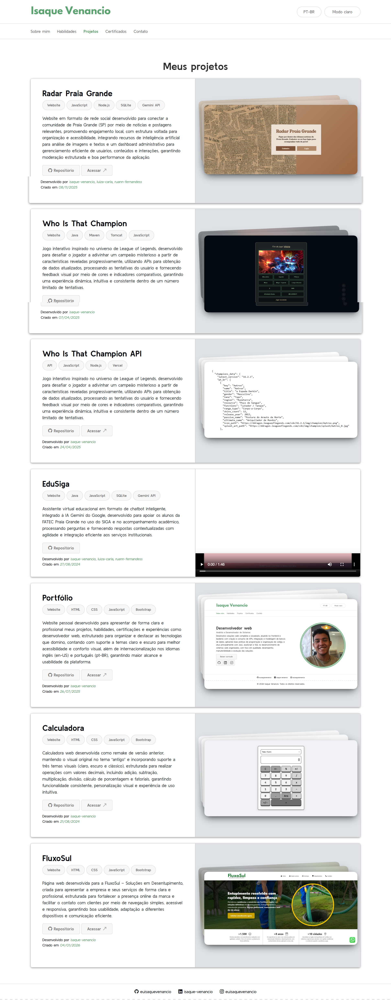
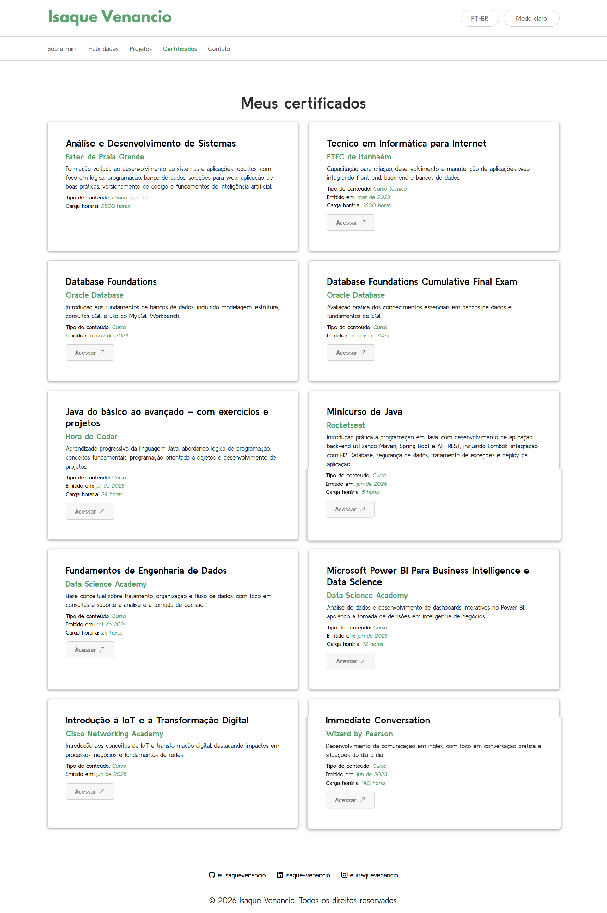

    

    
    
    

---

    Página web desenvolvida para o meu portfólio pessoal, com o objetivo de apresentar meu perfil, projetos e habilidades, fortalecer minha presença online e facilitar o contato de forma clara e acessível em qualquer dispositivo. O projeto oferece suporte aos idiomas PT-BR e EN-US, além de alternância entre os temas Claro e Escuro, proporcionando uma experiência personalizada ao usuário.

---

    

---

## Por que foi construído
Este projeto foi desenvolvido com o objetivo de demonstrar minhas habilidades em desenvolvimento web, apresentar um pouco mais sobre mim, meus projetos realizados, currículo, certificados e disponibilizar minhas redes sociais para contato.

Além de servir como vitrine profissional, o site também representa a aplicação prática dos meus conhecimentos, utilizando tecnologias comuns do mercado e boas práticas de desenvolvimento para construir uma solução funcional, organizada e alinhada a padrões profissionais.

## Linguagens & ferramentas

## Instrução de uso

Para acessar o projeto, basta **[clicar aqui](https://euisaquevenancio.github.io/portfolio/)**.

---

    

---

    

---

    

